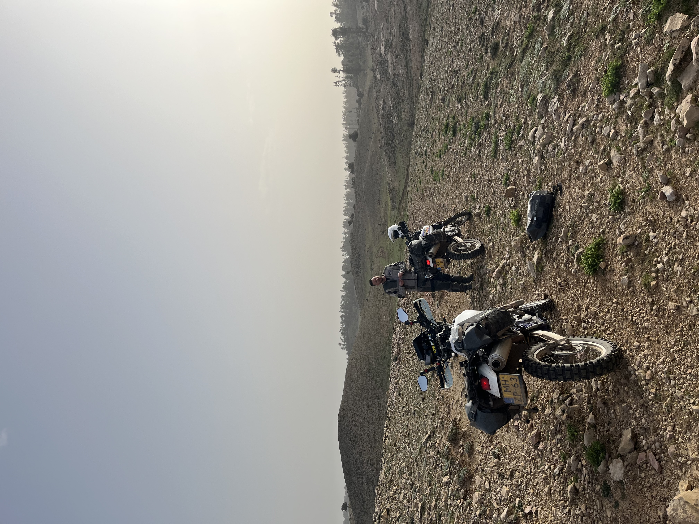

### Our bikes

Some info on our bikes, the Suzuki DR650SE.

For our trip, we got 2 identical bikes, so that we can limit the amount of spare parts and tools that we have to take. Also, we can share our knowledge and become familiar with just one bike instead of two! We opted for the DR650SE, a bullet-proof and straightforward motorcycle that has proven ideal for this type of adventure. Securing two DR650s in the Netherlands wasn't easy, but we succeeded in getting two excellent models from 1996 and 1997:

Both bikes got the common upgrades to make them suitable for the trip:

- Bigger tank
- Upgraded suspension
- Custom seats
- Bar risers
- New handlebars / hand guards
- Double take mirrors
- Lowered footpegs
- 18" rear wheel
- Bash plate + case savers
- Changed all lights to LED
- 40F0 exhausts
- Lithium battery

